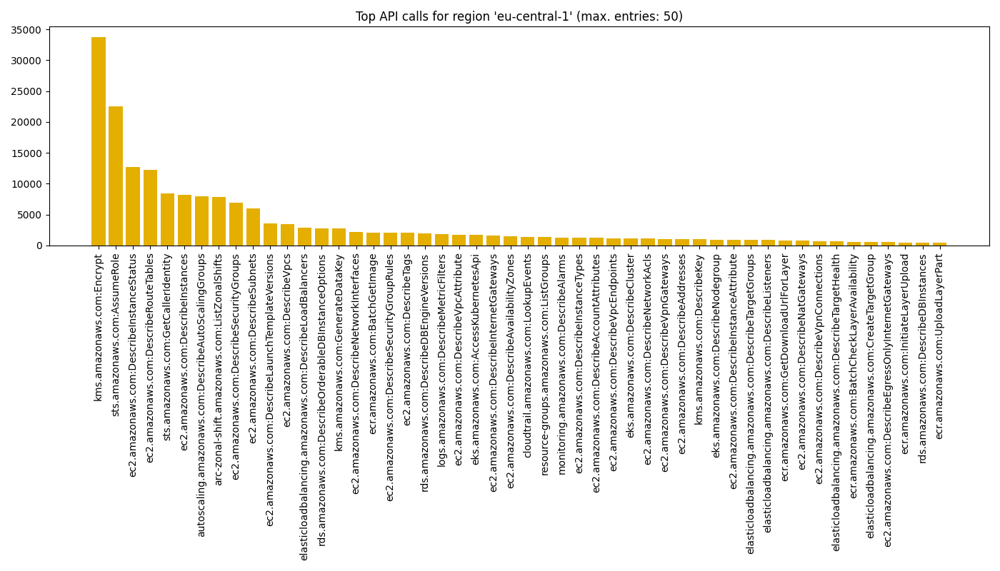
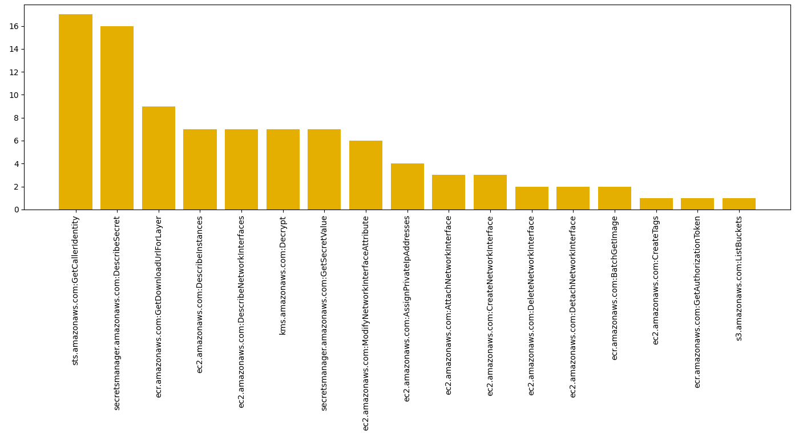

# aws-summarize-account-activity

Analyzes CloudTrail data of a given AWS account and generates a summary of recently active IAM principals, API calls they made and regions that were used. The summary is written to a JSON output file and can optionally be visualized as PNG files. See the accompanying blog posts 
[here](https://medium.com/@michael.kirchner/how-to-get-an-overview-of-activities-going-on-within-an-aws-account-cb1608076819) and [here](https://medium.com/@michael.kirchner/visualizing-api-call-activity-in-your-aws-account-e5b37b520106). 


## Usage

Make sure you have AWS credentials configured for your target account. This can either be done using [environment 
variables](https://docs.aws.amazon.com/cli/latest/userguide/cli-configure-envvars.html) or by specifying a [named 
profile](https://docs.aws.amazon.com/cli/latest/userguide/cli-configure-files.html) in the optional `--profile` 
argument. The minimum required IAM permissions are listed below. 

Example run:

```bash
pip install -r requirements.txt

python aws_summarize_account_activity.py
```


## Supported arguments

All arguments are optional:

```
--past-hours HOURS
    hours of CloudTrail data to look back and analyze
    default: 336 (=14 days), minimum: 1, maximum: 2160 (=90 days)
--plot-results
    generate PNG files that visualize the JSON output file
--profile PROFILE
    named AWS profile to use when running the command
--skip-unsuccessful-api-calls
    do not analyze CloudTrail logs of API calls that were declined with an error message
```


## Notes

* The script uses the `LookupEvents` action of the CloudTrail API to extract information on account activity:

  https://docs.aws.amazon.com/awscloudtrail/latest/APIReference/API_LookupEvents.html

  This approach has the advantage that it does not require any specific configuration to be present in the target account. There is no need for CloudTrail to be enabled or configured in a certain way (e.g., logging to S3 or CloudWatch). Instead, the script analyzes the CloudTrail event history that is available by default and covers the past 90 days.
  
* Using the `LookupEvents` action comes with the drawback that AWS throttles the API to two requests per second. The script will thus need proportionally more time for AWS accounts with lots of AWS API call activity. If the script takes too long for your use case, consider reducing the timeframe of data analyzed via the `--past-hours` argument. Alternatively, if you are in the position to make changes to the AWS account, analyze large amounts of CloudTrail data using AWS Athena or CloudTrail Lake:

  https://docs.aws.amazon.com/athena/latest/ug/cloudtrail-logs.html
  
  https://docs.aws.amazon.com/awscloudtrail/latest/userguide/cloudtrail-lake.html

* The script analyzes management events that were logged to CloudTrail. Please note that there are some AWS API actions that do not get logged: CloudTrail logging support varies from service to service. Similarly, the script analyzes all regions that are currently enabled in the target account. If a region was used in the past 90 days, but is now disabled, the script cannot access the respective CloudTrail data.

* The JSON output file does not contain the actual data that IAM principals have exchanged with AWS services (raw API request and response contents). Instead, the output shows aggregated statistics on account activity.


## Minimum IAM permissions required

```json
{
    "Version": "2012-10-17",
    "Statement": [
        {
            "Effect": "Allow",
            "Action": [
                "ec2:DescribeRegions",
                "cloudtrail:LookupEvents"
            ],
            "Resource": "*"
        }
    ]
}
```


## Example output file

Truncated example JSON output file:
```json
{
  "_metadata": {
    "account_id": "123456789012",
    "account_principal": "arn:aws:iam::123456789012:user/myuser",
    "cloudtrail_data_analyzed": {
      "from_timestamp": "20230315135630",
      "to_timestamp": "20230329135630"
    },
    "regions_enabled": [
      "af-south-1",
      "ap-northeast-1",
      "ap-northeast-2",
      "ap-northeast-3",
      "ap-south-1",
      "ap-southeast-1",
      "ap-southeast-2",
      "ca-central-1",
      "eu-central-1",
      "eu-north-1",
      "eu-west-1",
      "eu-west-2",
      "eu-west-3",
      "sa-east-1",
      "us-east-1",
      "us-east-2",
      "us-west-1",
      "us-west-2"
    ],
    "regions_failed": {},
    "run_timestamp": "20230329135630"
  },
  "api_calls_by_principal": {
    "123456789012": {
      "ssm.amazonaws.com:OpenDataChannel": 6
    },
    "AWS Internal": {
      "kms.amazonaws.com:Decrypt": 2,
      "sts.amazonaws.com:AssumeRole": 1
    },
    "arn:aws:iam::123456789012:user/myuser": {
      "access-analyzer.amazonaws.com:ListPolicyGenerations": 5,
      "access-analyzer.amazonaws.com:ValidatePolicy": 13,
      "ce.amazonaws.com:GetCostAndUsage": 3,
      "ce.amazonaws.com:GetCostForecast": 3,
      "cloudtrail.amazonaws.com:DescribeTrails": 2,
      "cloudtrail.amazonaws.com:GetTrailStatus": 1,
      "cloudtrail.amazonaws.com:ListEventDataStores": 2,
      "cloudtrail.amazonaws.com:LookupEvents": 44,
      "config.amazonaws.com:DescribeConfigurationRecorderStatus": 1,
      "config.amazonaws.com:DescribeConfigurationRecorders": 1,
      "ec2.amazonaws.com:DescribeAccountAttributes": 3,
      "ec2.amazonaws.com:DescribeRegions": 1,
      "health.amazonaws.com:DescribeEventAggregates": 86,
      "iam.amazonaws.com:AttachRolePolicy": 1,
      "iam.amazonaws.com:CreateAccessKey": 1,
      "iam.amazonaws.com:CreateRole": 1,
      "iam.amazonaws.com:CreateUser": 1,
      "iam.amazonaws.com:DeleteAccessKey": 1,
      "iam.amazonaws.com:DeleteRole": 3,
      // ...
      "signin.amazonaws.com:ConsoleLogin": 6,
      "sso.amazonaws.com:DescribeRegisteredRegions": 1,
      "sts.amazonaws.com:GetCallerIdentity": 1
    },
    "arn:aws:sts::123456789012:role/EC2_role": {
      "s3.amazonaws.com:ListBuckets": 2,
      "ssm.amazonaws.com:ListInstanceAssociations": 8,
      "ssm.amazonaws.com:UpdateInstanceInformation": 14
    },
    // ...
    "config.amazonaws.com": {
      "sts.amazonaws.com:AssumeRole": 28
    },
    "elasticfilesystem.amazonaws.com": {
      "kms.amazonaws.com:Decrypt": 8,
      "sts.amazonaws.com:AssumeRole": 9
    },
    // ...
  },
  "api_calls_by_region": {
    "af-south-1": {
      "cloudtrail.amazonaws.com:LookupEvents": 2
    },
    "ap-northeast-1": {
      "cloudtrail.amazonaws.com:GetServiceLinkedChannel": 28,
      "cloudtrail.amazonaws.com:LookupEvents": 7,
      "dynamodb.amazonaws.com:ListTables": 3,
      "ec2.amazonaws.com:DescribeAddresses": 3,
      "ec2.amazonaws.com:DescribeCapacityReservationFleets": 3,
      "ec2.amazonaws.com:DescribeCapacityReservations": 3,
      "ec2.amazonaws.com:DescribeClientVpnEndpoints": 3,
      "ec2.amazonaws.com:DescribeCustomerGateways": 3,
      "ec2.amazonaws.com:DescribeDhcpOptions": 3,
      "ec2.amazonaws.com:DescribeEgressOnlyInternetGateways": 3,
      // ...
    },
    // ...
    "us-east-1": {
      "access-analyzer.amazonaws.com:ListPolicyGenerations": 5,
      "access-analyzer.amazonaws.com:ValidatePolicy": 13,
      "ce.amazonaws.com:DescribeReport": 2,
      "ce.amazonaws.com:GetCostAndUsage": 17,
      "ce.amazonaws.com:GetCostForecast": 8,
      "ce.amazonaws.com:GetDimensionValues": 5,
      "ce.amazonaws.com:GetReservationPurchaseRecommendation": 1,
      "ce.amazonaws.com:GetReservationUtilization": 2,
      "cloudfront.amazonaws.com:ListCachePolicies": 47,
      "cloudfront.amazonaws.com:ListCloudFrontOriginAccessIdentities": 46,
      "cloudfront.amazonaws.com:ListDistributions": 46,
      "cloudfront.amazonaws.com:ListFunctions": 43,
      "cloudfront.amazonaws.com:ListOriginRequestPolicies": 46,
      // ...
    }
    // ...
  }
}
```


## Example visualizations

When using the optional `--plot-results` argument, visualizations of the API call activity are generated as PNG files. 

Example distribution of API calls across regions:


Example distribution of API calls within a specific region, e.g., `eu-central-1`:


Example distribution of API calls of a specific principal, e.g., an EKS node IAM role:



## Generating visualizations retroactively
If you have an existing JSON output file from a previous run and want to generate PNG visualizations for it, you can do so via:

```bash
python generate_plots_for_existing_json_file.py --file account_activity_123456789012_20230329135630.json
```

